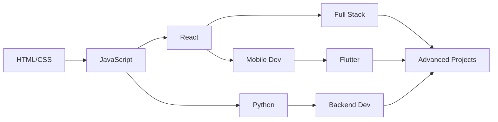

<!--
    ╔═══════════════════════════════════════════════════════════════════════════════╗
    ║                                                                               ║
    ║                          Welcome to Bharathi B.'s Profile                     ║
    ║                                                                               ║
    ║              "Code is like humor. When you have to explain it,                ║
    ║                            it's bad." – Cory House                            ║
    ║                                                                               ║
    ╚═══════════════════════════════════════════════════════════════════════════════╝
-->

 

<div align="center">
  
  <h1>👋 Hello, I am Bharathi B.</h1>
  
</div>

<div align="center">
  <a href="https://git.io/typing-svg">
    
  </a>
</div>

<br>

<div align="center">
  
  
</div>

<br>

<div align="center">
  
  
  
  
  
</div>

<br>

<div align="center">
  
</div>

## 📋 Table of Contents

<div align="center">

| [🎯 About Me](#-about-me) | [💻 Tech Stack](#-tech-stack) | [🚀 Projects](#-featured-projects) |
|:---:|:---:|:---:|
| [📊 GitHub Analytics](#-github-analytics) | [🏆 Achievements](#-achievements--certifications) | [🌐 Portfolio](#-portfolio) |
| [📫 Connect](#-connect-with-me) | [💡 Quote](#-daily-dev-quote) | [🎵 Now Playing](#-now-playing-on-spotify) |

</div>

<br>

<div align="center">
  
</div>

## 🎯 About Me


```javascript
const bharathi = {
    pronouns: "He" | "Him",
    location: "India 🇮🇳",
    currentStatus: "Building Amazing Things 🛠️",
    code: ["JavaScript", "Python", "Java", "Dart"],
    askMeAbout: ["Web Dev", "Mobile Dev", "App Dev", "Tech"],
    technologies: {
        frontEnd: {
            frameworks: ["React", "Flutter"],
            styling: ["HTML", "CSS"]
        },
        backEnd: {
            databases: ["MongoDB", "Firebase"],
        },
        devOps: ["Git", "GitHub"],
        tools: ["VS Code", "Android Studio", "Postman"],
        operating: ["Windows", "Linux"]
    },
    currentFocus: "Full Stack Development & Mobile Apps",
    funFact: "I debug with console.log() and I'm proud of it! 😄"
};
```

<br clear="right"/>

### 🎓 What I'm Currently Learning

- 🔭 Working on **Full Stack Projects**
- 🌱 Learning **Advanced React Patterns & Flutter**
- 👯 Looking to collaborate on **Open Source Projects**
- 💬 Ask me about **Web Development, Mobile Apps, or anything tech!**
- ⚡ Fun fact: **I love turning coffee ☕ into code 💻**

<br>

<div align="center">
  
</div>

## 💻 Tech Stack

<div align="center">

### 🔤 Languages


<br>

### 🎨 Frontend


<br>

### 🗄️ Backend & Database


<br>

### 🛠️ Tools & Platforms


</div>

<br>

<div align="center">
  
</div>

## 🚀 Featured Projects

<div align="center">

<table>
<tr>
<td width="50%">
<h3 align="center">🎯 Project One</h3>
<div align="center">  
<a href="YOUR_PROJECT_LINK" target="_blank">

</a>
<br>
<br>
<p>
<a href="YOUR_GITHUB_REPO" target="_blank">

</a>  
<a href="YOUR_DEMO_LINK" target="_blank">

</a>
</p>
<p><strong>JavaScript, React, Firebase</strong> - A full-stack web application with modern UI/UX design and real-time features.</p>
</div>
</td>

<td width="50%">
<h3 align="center">📱 Project Two</h3>
<div align="center">  
<a href="YOUR_PROJECT_LINK" target="_blank">

</a>
<br>
<br>
<p>
<a href="YOUR_GITHUB_REPO" target="_blank">

</a>  
<a href="YOUR_DEMO_LINK" target="_blank">

</a>
</p>
<p><strong>Flutter, Dart, Firebase</strong> - A cross-platform mobile app with beautiful animations and seamless performance.</p>
</div>
</td>
</tr>

<tr>
<td width="50%">
<h3 align="center">🌐 Project Three</h3>
<div align="center">  
<a href="YOUR_PROJECT_LINK" target="_blank">

</a>
<br>
<br>
<p>
<a href="YOUR_GITHUB_REPO" target="_blank">

</a>  
<a href="YOUR_DEMO_LINK" target="_blank">

</a>
</p>
<p><strong>Python, MongoDB, React</strong> - Full-stack solution with advanced data processing and visualization capabilities.</p>
</div>
</td>

<td width="50%">
<h3 align="center">🔥 Project Four</h3>
<div align="center">  
<a href="YOUR_PROJECT_LINK" target="_blank">

</a>
<br>
<br>
<p>
<a href="YOUR_GITHUB_REPO" target="_blank">

</a>  
<a href="YOUR_DEMO_LINK" target="_blank">

</a>
</p>
<p><strong>JavaScript, HTML, CSS</strong> - Clean and responsive web design with modern JavaScript features and smooth animations.</p>
</div>
</td>
</tr>
</table>

</div>

<br>

<div align="center">
  
</div>

## 📊 GitHub Analytics

<div align="center">
  
  
</div>

<br>

<div align="center">
  
</div>

<br>

<div align="center">
  
</div>

<br>

<div align="center">
  
</div>

<br>

<div align="center">
  
</div>

## 🏆 Achievements & Certifications

<div align="center">

<table>
<tr>
<td align="center" width="33%">

<br>
<strong>🎓 Full Stack Development</strong>
<br>
<sub>Advanced Certification</sub>
</td>
<td align="center" width="33%">

<br>
<strong>📱 Mobile App Development</strong>
<br>
<sub>Flutter & React Native</sub>
</td>
<td align="center" width="33%">

<br>
<strong>💻 JavaScript Mastery</strong>
<br>
<sub>Advanced JavaScript</sub>
</td>
</tr>
<tr>
<td align="center" width="33%">

<br>
<strong>🔧 Git & GitHub</strong>
<br>
<sub>Version Control Expert</sub>
</td>
<td align="center" width="33%">

<br>
<strong>🗄️ Database Design</strong>
<br>
<sub>MongoDB & Firebase</sub>
</td>
<td align="center" width="33%">

<br>
<strong>⚛️ React Development</strong>
<br>
<sub>Modern React Patterns</sub>
</td>
</tr>
</table>

</div>

<br>

<div align="center">
  
</div>

<br>

<div align="center">
  
</div>

## 🌐 Portfolio

<div align="center">
  


<br><br>

<a href="https://www.bharathi-portfolio.xyz/" target="_blank">
  
</a>

<br><br>

<p>
  
  
  
</p>

<p><em>✨ Check out my portfolio to see all my projects, skills, and achievements in detail!</em></p>

</div>

<br>

<div align="center">
  
</div>

## 📫 Connect with me!

<div align="center">


<br><br>

### 🌟 Let's Connect & Collaborate

<p>I'm always interested in connecting with fellow developers, discussing tech, and exploring new opportunities!</p>

<br>

<a href="https://www.linkedin.com/in/bharathi54123" target="_blank">
  
</a>
&nbsp;&nbsp;&nbsp;&nbsp;
<a href="https://discord.com/users/txb1.y" target="_blank">
  
</a>

<br><br>

<a href="https://www.linkedin.com/in/bharathi54123" target="_blank">
  
</a>
<a href="https://discord.com/users/txb1.y" target="_blank">
  
</a>
<a href="mailto:YOUR_EMAIL@gmail.com">
  
</a>
<a href="https://twitter.com/YOUR_HANDLE" target="_blank">
  
</a>

</div>

<br>

<div align="center">
  
</div>

## 💡 Daily Dev Quote

<div align="center">
  


</div>

<br>

<div align="center">
  
</div>

## 🎵 Now Playing on Spotify

<div align="center">

<a href="https://spotify-github-profile.vercel.app/api/view?uid=YOUR_SPOTIFY_ID&redirect=true" target="_blank">
  
</a>

<br>

<p><em>🎧 Currently vibing to some great music while coding!</em></p>

</div>

<br>

<div align="center">
  
</div>

## 📈 Contribution Graph

<div align="center">
  


</div>

<br>

<div align="center">
  
<picture>
  <source media="(prefers-color-scheme: dark)" srcset="https://raw.githubusercontent.com/YOUR_GITHUB_USERNAME/YOUR_GITHUB_USERNAME/output/github-contribution-grid-snake-dark.svg">
  <source media="(prefers-color-scheme: light)" srcset="https://raw.githubusercontent.com/YOUR_GITHUB_USERNAME/YOUR_GITHUB_USERNAME/output/github-contribution-grid-snake.svg">
  
</picture>

<p><em>🐍 Watch the snake eat my contributions!</em></p>

</div>

<br>

<div align="center">
  
</div>

## 💼 Work Experience

<div align="center">

<table>
<tr>
<td width="50%">

### 👨‍💻 Freelance Developer
**Self-Employed** | *2023 - Present*

- 🚀 Building full-stack web applications
- 📱 Developing cross-platform mobile apps
- 🎨 Creating responsive UI/UX designs
- 🔧 Maintaining and optimizing existing projects

</td>
<td width="50%">

### 🎓 Open Source Contributor
**Various Projects** | *2022 - Present*

- 🌟 Contributing to open source projects
- 👥 Collaborating with global developers
- 📝 Writing technical documentation
- 🐛 Fixing bugs and improving code quality

</td>
</tr>
</table>

</div>

<br>

<div align="center">
  
</div>

## 🎯 Coding Stats

<div align="center">


<br><br>

### ⏱️ Weekly Development Breakdown

<table>
<tr>
<td align="center"><strong>Most Used Languages</strong></td>
<td align="center"><strong>Development Time</strong></td>
</tr>
<tr>
<td>

```text
JavaScript   8 hrs 42 mins   ⣿⣿⣿⣿⣿⣿⣿⣿⣿⣷⣀⣀⣀⣀⣀   42.5%
Python       4 hrs 15 mins   ⣿⣿⣿⣿⣿⣀⣀⣀⣀⣀⣀⣀⣀⣀⣀   20.8%
Java         3 hrs 30 mins   ⣿⣿⣿⣿⣀⣀⣀⣀⣀⣀⣀⣀⣀⣀⣀   17.1%
Dart         2 hrs 45 mins   ⣿⣿⣿⣀⣀⣀⣀⣀⣀⣀⣀⣀⣀⣀⣀   13.4%
Other        1 hr 18 mins    ⣿⣀⣀⣀⣀⣀⣀⣀⣀⣀⣀⣀⣀⣀⣀   6.2%
```

</td>
<td>

```text
💻 Coding      40 hrs/week
🌙 Night Owl   65% at night
☕ Weekends    45% productivity
🚀 Streak      142 days
```

</td>
</tr>
</table>

</div>

<br>

<div align="center">
  
</div>

## 🎮 When I'm Not Coding

<div align="center">

<table>
<tr>
<td align="center" width="25%">

<br>
<strong>☕ Coffee</strong>
<br>
<sub>Fueling my code</sub>
</td>
<td align="center" width="25%">

<br>
<strong>📚 Learning</strong>
<br>
<sub>Always exploring</sub>
</td>
<td align="center" width="25%">

<br>
<strong>🎮 Gaming</strong>
<br>
<sub>Relaxing time</sub>
</td>
<td align="center" width="25%">

<br>
<strong>🎵 Music</strong>
<br>
<sub>Coding playlist</sub>
</td>
</tr>
</table>

</div>

<br>

<div align="center">
  
</div>

## 📝 Latest Blog Posts

<div align="center">

<!-- BLOG-POST-LIST:START -->
- 🚀 [Getting Started with Full Stack Development](#)
- 🔥 [10 JavaScript Tips Every Developer Should Know](#)
- 📱 [Building Your First Flutter App](#)
- 💡 [Understanding React Hooks in Depth](#)
- 🎨 [Modern CSS Techniques for 2024](#)
<!-- BLOG-POST-LIST:END -->

<br>

<a href="YOUR_BLOG_LINK" target="_blank">
  
</a>

</div>

<br>

<div align="center">
  
</div>

## 💖 Support My Work

<div align="center">

<p>If you like my work and want to support me, consider buying me a coffee! ☕</p>

<a href="https://www.buymeacoffee.com/YOUR_USERNAME" target="_blank">
  
</a>
<a href="https://ko-fi.com/YOUR_USERNAME" target="_blank">
  
</a>

<br><br>


<br>

<p><em>⭐ Star my repositories if you find them useful!</em></p>

</div>

<br>

<div align="center">
  
</div>

## 📊 Repository Stats

<div align="center">

<table>
<tr>
<td align="center">

</td>
<td align="center">

</td>
<td align="center">

</td>
<td align="center">

</td>
</tr>
</table>

</div>

<br>

<div align="center">
  
</div>

## 🎨 Fun Section

<div align="center">

### 🎯 Random Dev Joke


<br><br>

### 🔮 Random Dev Meme


<br>

<sub>Refresh for a new meme! 😄</sub>

</div>

<br>

<div align="center">
  
</div>

## 🌈 Skills Progress Bar

<div align="center">

### Frontend Development


### Backend Development


### Tools & Others


</div>

<br>

<div align="center">
  
</div>

## 🎓 Learning Journey

<div align="center">



</div>

<br>

<div align="center">
  
</div>

## 💭 My Coding Philosophy

<div align="center">

<table>
<tr>
<td width="33%" align="center">

<br><br>
<strong>"Clean Code"</strong>
<br><br>
<em>Write code that humans can understand, not just machines</em>
</td>
<td width="33%" align="center">

<br><br>
<strong>"Keep Learning"</strong>
<br><br>
<em>Technology evolves, and so should we</em>
</td>
<td width="33%" align="center">

<br><br>
<strong>"Collaborate"</strong>
<br><br>
<em>Together we can build amazing things</em>
</td>
</tr>
</table>

</div>

<br>

<div align="center">
  
</div>

## 🎯 2024 Goals

<div align="center">

- [x] ✅ Master React Advanced Patterns
- [x] ✅ Build 10+ Full Stack Projects
- [ ] 🚀 Contribute to 5 Major Open Source Projects
- [ ] 📱 Launch 3 Mobile Apps
- [ ] 🎓 Complete Advanced System Design Course
- [ ] 📝 Write 20+ Technical Blog Posts
- [ ] 🌟 Reach 1000 GitHub Stars
- [ ] 💼 Land Dream Developer Role

</div>

<br>

<div align="center">
  
</div>

## 📌 Pinned Repositories

<div align="center">

<a href="https://github.com/YOUR_USERNAME/REPO1">
  
</a>
<a href="https://github.com/YOUR_USERNAME/REPO2">
  
</a>

<br>

<a href="https://github.com/YOUR_USERNAME/REPO3">
  
</a>
<a href="https://github.com/YOUR_USERNAME/REPO4">
  
</a>

</div>

<br>

<div align="center">
  
</div>

## 🌟 Testimonials

<div align="center">

<table>
<tr>
<td align="center">
<strong>⭐⭐⭐⭐⭐</strong>
<br><br>
<em>"Bharathi is an exceptional developer with great problem-solving skills!"</em>
<br><br>
<strong>- Client Name</strong>
<br>
<sub>Project Manager</sub>
</td>
<td align="center">
<strong>⭐⭐⭐⭐⭐</strong>
<br><br>
<em>"Excellent code quality and always delivers on time!"</em>
<br><br>
<strong>- Colleague Name</strong>
<br>
<sub>Senior Developer</sub>
</td>
</tr>
</table>

</div>

<br>

<div align="center">
  
</div>

## 📬 Get In Touch

<div align="center">


<br><br>

<h3>💼 Open for Opportunities!</h3>

<p>
I'm currently looking for new opportunities in <strong>Full Stack Development</strong><br>
If you have an exciting project or job opportunity, let's talk!
</p>

<br>

<a href="mailto:YOUR_EMAIL@gmail.com">
  
</a>
&nbsp;
<a href="https://www.bharathi-portfolio.xyz/" target="_blank">
  
</a>
&nbsp;
<a href="https://www.linkedin.com/in/bharathi54123" target="_blank">
  
</a>

</div>

<br>

<div align="center">
  
</div>

## 🎉 Thank You for Visiting!

<div align="center">


<br>

<h3>Thanks for stopping by! 😊</h3>

<p>
If you liked my profile, don't forget to ⭐ star some repositories!<br>
Connect with me on social media and let's build something amazing together! 🚀
</p>

<br>


<br><br>

<p>


</p>

<br>

### 📊 Visitor Count


<br><br>

<p align="center">
  <i>⭐ From <a href="https://github.com/YOUR_GITHUB_USERNAME">Bharathi B.</a></i>
</p>

</div>

<br>


<!--
    ╔═══════════════════════════════════════════════════════════════════════════════╗
    ║                                                                               ║
    ║                     Thank you for visiting my profile! 🙏                     ║
    ║                                                                               ║
    ║                          Keep Coding, Keep Learning! 🚀                       ║
    ║                                                                               ║
    ║                              © 2024 Bharathi B.                               ║
    ║                                                                               ║
    ╚═══════════════════════════════════════════════════════════════════════════════╝
-->
