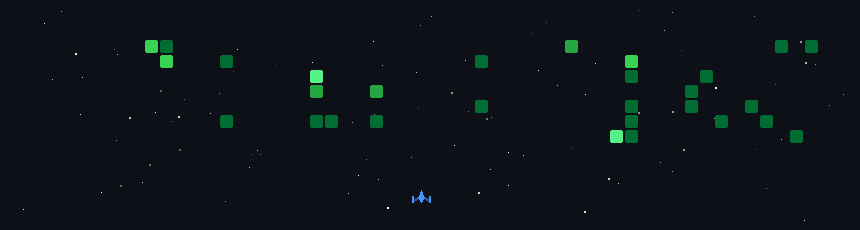

<div align="center">

<a href="https://www.bharathii.me">
  
</a>

<h1>Building useful software from bold ideas.</h1>

<p>
  <a href="https://www.bharathii.me"><strong>Portfolio</strong></a>
  &nbsp;·&nbsp;
  <a href="https://github.com/bharathi-codes?tab=repositories"><strong>Projects</strong></a>
  &nbsp;·&nbsp;
  <a href="https://www.linkedin.com/in/bharathi54123"><strong>LinkedIn</strong></a>
</p>

<p>
  
  
</p>

</div>

## Hello, I'm Bharathi

I'm an **AI & Full-Stack Developer** from India who enjoys turning ambitious ideas into reliable, user-centered products. My work sits at the intersection of **AI integration, scalable web applications, mobile experiences, and automation**.

I'm a **4× National Hackathon Finalist** and I enjoy the full build journey: shaping the idea, designing the experience, shipping the first version, and improving it with every iteration.

```text
Currently exploring  →  AI products · full-stack architecture · automation
I enjoy building    →  intelligent tools · mobile apps · data-driven systems
Open to             →  software engineering, AI development & open-source collaboration
```

## What I build

<table>
  <tr>
    <td width="33%" valign="top">
      <h3>✦ AI-powered products</h3>
      <p>Practical tools that connect modern AI capabilities with clear, human-friendly experiences.</p>
    </td>
    <td width="33%" valign="top">
      <h3>✦ Full-stack systems</h3>
      <p>Thoughtful interfaces, dependable backends, and the infrastructure that connects them.</p>
    </td>
    <td width="33%" valign="top">
      <h3>✦ Automation & IoT</h3>
      <p>Systems that remove repetitive work and make real-world workflows more intelligent.</p>
    </td>
  </tr>
</table>

## Selected work

| Project | What it is | Stack |
| --- | --- | --- |
| [**AgroSense**](https://github.com/bharathi-codes/AgroSense) | A mobile-first approach to smarter agricultural workflows. | Dart · Flutter |
| [**Survey Analytics Automation**](https://github.com/bharathi-codes/Survey_Analytics_Automation) | Turning survey data into useful, repeatable insights. | Python |
| [**Road2Java**](https://road2java.vercel.app) | A focused learning experience for the Java journey. | JavaScript |
| [**NASA APOD Explorer**](https://github.com/bharathi-codes/NASA-APOD-Explorer) | Explore NASA's Astronomy Picture of the Day through a responsive web experience. | Web |
| [**Smart Home Automation**](https://github.com/bharathi-codes/Smart-Home-Automation-Intelligent-Control-for-Modern-Living) | Intelligent control concepts for a connected home. | C++ |

<p align="center">
  <a href="https://github.com/bharathi-codes?tab=repositories">
    
  </a>
</p>

## Toolbox

<p>
  
</p>

<details>
<summary><strong>How I work</strong></summary>
<br>

- **Start with the user:** the best technical solution is the one that solves the right problem.
- **Build in slices:** ship a clear first version, learn from it, then make it stronger.
- **Keep it understandable:** clean boundaries and readable code make ambitious systems easier to evolve.
- **Stay curious:** the fastest way to grow is to keep building outside the comfort zone.

</details>

## GitHub at a glance

<div align="center">
  
  
</div>

## Let's build something meaningful

If you're working on an ambitious product, an AI-enabled workflow, or an open-source idea with real users in mind, I'd love to hear about it.

<div align="center">

<a href="https://www.bharathii.me">
  
</a>
<a href="https://www.linkedin.com/in/bharathi54123">
  
</a>
<a href="https://github.com/bharathi-codes">
  
</a>

<br><br>



<sub>Thanks for stopping by. Keep building. ✦</sub>

</div>

<br>

<div align="center">
  
</div>
